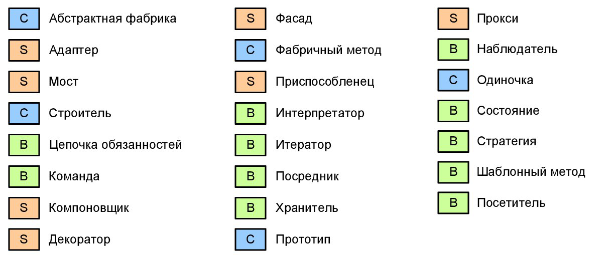

<h1>Паттерны проектирования</h1> 

Паттерны проектирования – это подходы к решению практических задач, выявленные при анализе
полученных решений и применяемые многократно. Паттерны не открывают или изобретают – они
выявляются как повторяющиеся конструкции в коде, структуре или архитектуре при разработке
программ. 

<h1>Условные обозначения</h1>
<h2>Отношения между классами</h2>  

— агрегация (aggregation) — описывает связь «часть»–«целое», в котором «часть» может существовать отдельно от «целого». Ромб указывается со стороны «целого». 

—  композиция (composition) — подвид агрегации, в которой «части» не могут существовать отдельно от «целого». 

—  зависимость (dependency) — изменение в одной сущности (независимой) может влиять на состояние или поведение другой сущности (зависимой). Со стороны стрелки указывается независимая сущность. 

—  обобщение (generalization) — отношение наследования или реализации интерфейса. Со стороны стрелки находится суперкласс или интерфейс. 

<h3>Каталог GoF классифицирует паттерны по трем целям</h3> 

—  поведенческие (behavioral); 

—  порождающие (creational); 

—  структурные (structural). 

<h2>СПИСОК</h2> 

[//]: # (![list.png]&#40;src%2Fmain%2Fresources%2Fenter%2Flist.png&#41;  )
 

<h2>Паттерны</h2> 

